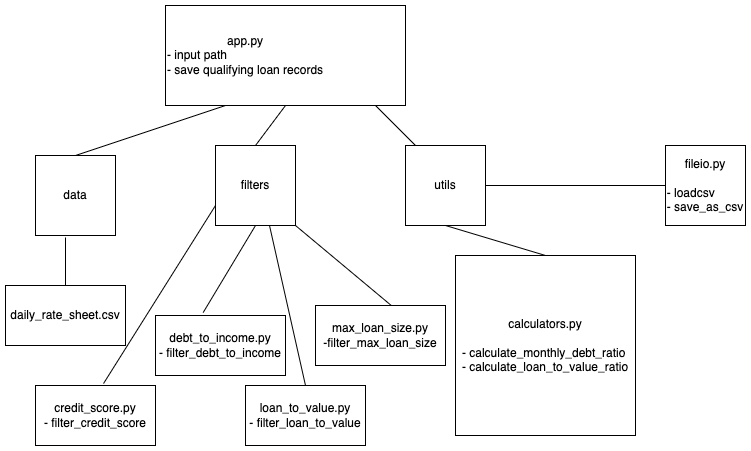
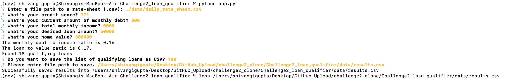
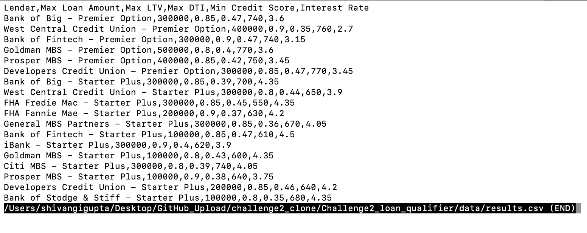
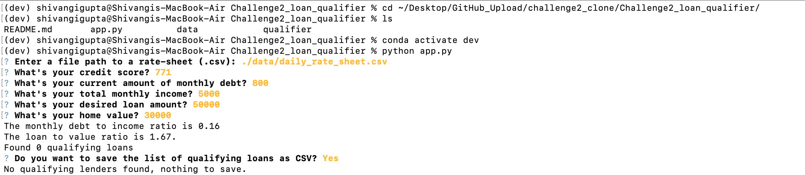
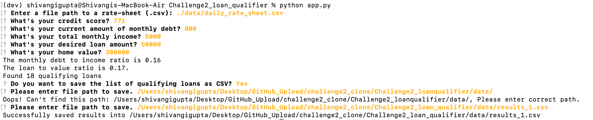
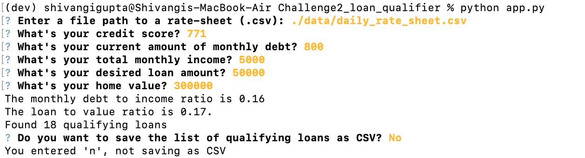

# **Loan Qualifier Application**

It is an application which works on python command line interface and enables its users to get a list of qualifying lenders which matches the user's loan requrirement criteria and further save the same easily.
The application works by comparing the `daily_rate_sheet` of loan criteria from various loan providers with the users requirements. To do so, it asks and allows the user to dynamically enter information on requirements and other loan parameters such as: loan amount, credit score,debt etc., and returns a list of qualifying lenders.
The application further gives user, the option to save the resulting list of qualifying lenders(if any) as CSV by enabling user to enter the file path or opt out.



---

## Technologies

This project leverages python 3.7 with the following packages:

* [fire](https://github.com/google/python-fire) - For the command line interface, help page, and entrypoint.

* [questionary](https://github.com/tmbo/questionary) - For interactive user prompts and dialogs

* [sys](https://docs.python.org/3/library/sys.html) - For exiting from python at the end of application process

* [path] (https://docs.python.org/3/library/os.path.html) - For CSV file paths to read and write

---

## Installation Guide

Before running the application first install the following dependencies.

```python
  pip install fire
  pip install questionary
  ```

---

  ## Usage

To use the loan qualifier application simply clone the repository and run the **app.py** with:

```python
python app.py
```
Upon launching the loan qualifier application you will be greeted with different prompts to input loan data and options to save
qualifying loans data as CSV by providing file path or optout of the option through following stages:

* Asks the user to input path of rate sheet of loan criteria from various loan providers.
  Path for suppilied rate sheet is: ./data/daily_rate_sheet.csv
* Asks user to input their loan requirement parameters i.e. credit score, monthly debt, monthly income, loan amount and home value.
* Calculates monthly debt ration and Loan to value ratio with the entered data.

* Determines which loans the user qualifies for.
* Asks the user if they want to save the list of qualifying lenders as CSV file or opt out.

* If user chooses to save the file and there are no qualifying lenders, exits out printing the message that no qualifying lenders 
  found.
* If user chooses to save the file and there are any qualifying lenders, it asks the user to input file path to save CSV.
* Validates the path and saves the file and exits, else asks the user to enter valid path.

* If the user does not want to save the file, exits out of application


Following are the screenshots of the program run with different user inputs:

* Scenario 1: If there are qualifying loans and user chooses to save file as CSV and provide valid file path





* Scenario 2: If there are no qualifying loans for the user



* Scenario 3: If user chooses to save the list but provides invalid path



* Scenario 4: If user does not want to save the results of qualifying loans




---

## Contributor

UW Fintech Bootcamp team,
Shivangi Gupta

---

## License

MIT


